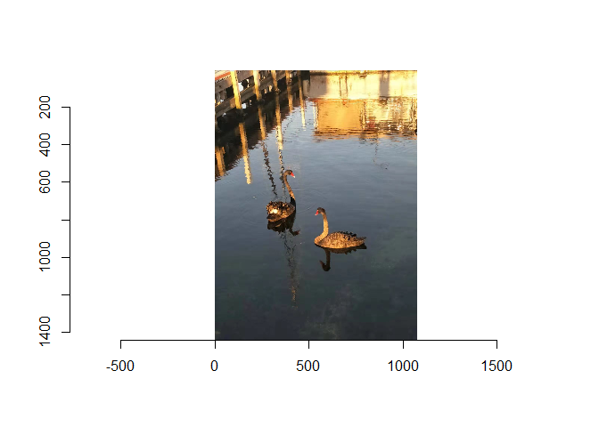
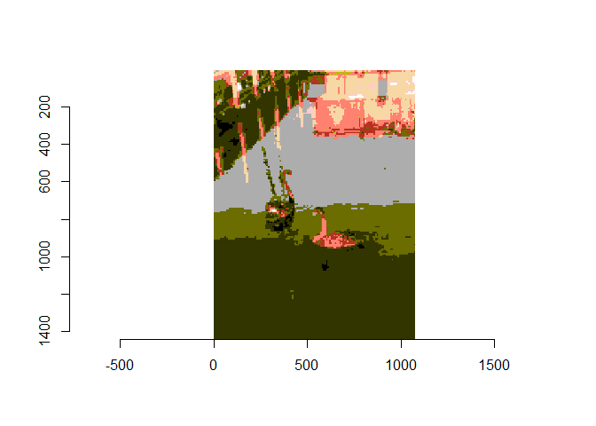
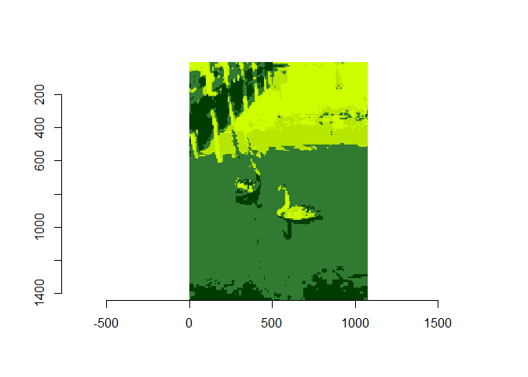

<!-- README.md is generated from README.Rmd. Please edit that file -->

# im2pix

<!-- badges: start -->

[](https://github.com/TengMCing/im2pix/actions)
<!-- badges: end -->

im2pix is a tool to convert image to pseudo pixel art. It’s a reduced
version of [Nathan Harper’s Python
script](https://github.com/nathanharper/phixelgator).

## Installation

You can install the released version of im2pix from
[GitHub](https://github.com/TengMCing/im2pix) with:

``` r
devtools::install_github("TengMCing/im2pix")
```

## Example

``` r
library(im2pix)
library(imager)
#> Loading required package: magrittr
#> 
#> Attaching package: 'imager'
#> The following object is masked from 'package:magrittr':
#> 
#>     add
#> The following objects are masked from 'package:stats':
#> 
#>     convolve, spectrum
#> The following object is masked from 'package:graphics':
#> 
#>     frame
#> The following object is masked from 'package:base':
#> 
#>     save.image
```

The built-in image

``` r
plot(sample_im)
```



Covert the image to pseudo pixel art using palette “contra”. Increase
the block size will decrease the output resolution.

``` r
out_pic <- imtopix(sample_im, pal = "contra", blockSize = 8)
plot(out_pic)
```



Using another palette

``` r
out_pic <- imtopix(sample_im, pal = "gameboy", blockSize = 8)
plot(out_pic)
```



Available palettes include

``` r
names(pal_collection)
#>  [1] "appleii"       "atari2600"     "commodore64"   "contra"       
#>  [5] "gameboy"       "grayscale"     "hyrule"        "intellivision"
#>  [9] "kungfu"        "mario"         "nes"           "sega"         
#> [13] "tetris"
```
